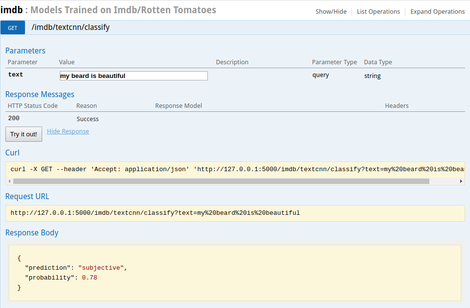

# NeuralZooAPI
Machine Learning API for DL models


## Milestones
- [x] Dockerize
- [x] Deploy to AWS
- [ ] TESTS
- [ ] TravisCI
- [x] Example endpoint with torchvision models
- [x] Depth in the Wild
- [x] Super Resolution
- [x] Neural Style (starry night and undine)
- [x] Subjective/Objective Sentence classification
- [ ] CoNLL Entity Detection
- [ ] Amazon Reviews Sentiment Analysis
- [ ] Word2Vec

## Endpoints
- Disclaimer: super resolution and depth in the wild still more training.


## Examples



# To Run
```bash
# clone repo
git clone https://github.com/A-Jacobson/NeuralZooAPI.git
cd NeuralZooAPI

# build dockerfile
docker build -t neuralzoo .
docker run -p 4000:80 neuralzoo

# api running on http://localhost:4000


# optionally, run in headless mode
docker run -d -p 4000:80 neuralzoo
 
# to stop headless mode
docker container ls # find CONTAINER ID
docker container stop <CONTAINER ID>

```

## Misc
```
# Swaggerui can't show images. Use to test transform endpoints
# super resolution can only handle very small images on cpu/aws micro
curl -F 'image=@data/NYU/train/2.png' 'http://127.0.0.1:5000/nyudepth/depthinthewild' > 'out.png'

```
