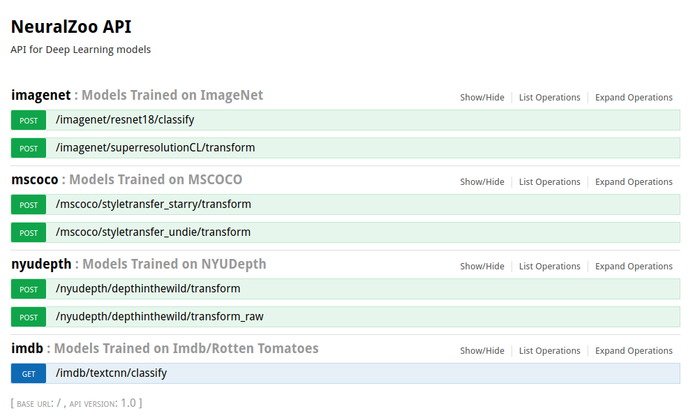

# NeuralZooAPI
Machine Learning API for DL models

**Why make an api?** For fun! Also, many models do very well \
on highly curated, academic datasets but fail in hilarious ways 
when exposed to inputs from "the wild". I hope to build a simple 
 interface ontop of this api that makes it trivial to throw wild inputs 
 at these models on a whim.


## Milestones
- [x] Dockerize
- [x] Deploy to AWS
- [ ] TESTS
- [ ] TravisCI
- [x] Example endpoint with torchvision models
- [x] Depth in the Wild
- [x] Super Resolution
- [x] Neural Style (starry night and undine)
- [x] Subjective/Objective Sentence classification
- [ ] CoNLL Entity Detection
- [ ] Amazon Reviews Sentiment Analysis
- [ ] Word2Vec
- [ ] Faster-RCNN
- [ ] Mask-RCNN

## Endpoints


## Examples
### Subjective/Objective Sentence Classification


## Image Classification
Image           |  Prediction
:-------------------------:|:-------------------------:
  |  

## Neural Style Transfer
Udnie Sloth           |  Starry Night Sloth 
:-------------------------:|:-------------------------:|
| 

## Super Resolution
- warning, needs more training to generalize, takes small (~72px) images only.

Low Resolution Input          |  4x Super Resolution 
:-------------------------:|:-------------------------:|
| 

## Depth Map Prediction from sparse labels
- warning, only trained on indoor scenes.

 RGB Input          |  Depth Map
:-------------------------:|:-------------------------:|
| 


# To Run
```bash
# clone repo
git clone https://github.com/A-Jacobson/NeuralZooAPI.git
cd NeuralZooAPI

# build dockerfile
docker build -t neuralzoo .
docker run -p 4000:80 neuralzoo

# api running on http://localhost:4000


# optionally, run in headless mode
docker run -d -p 4000:80 neuralzoo
 
# to stop headless mode
docker container ls # find CONTAINER ID
docker container stop <CONTAINER ID>

```

## Misc
```
# Swaggerui can't show images. Use to test transform endpoints
# super resolution can only handle very small images on cpu/aws micro
curl -F 'image=@data/NYU/train/2.png' 'http://127.0.0.1:5000/nyudepth/depthinthewild' > 'out.png'

```
